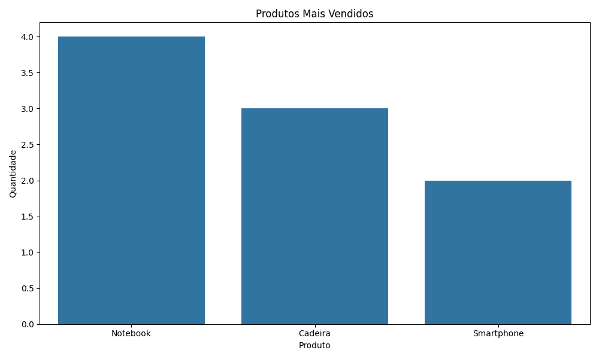

# 📈 Dashboard Gerado

O pipeline gera automaticamente um dashboard analítico com os produtos mais vendidos.



📊 ETL Data Pipeline

Projeto de Portfólio desenvolvido com Python para simular um processo completo de ETL (Extract, Transform and Load) aplicado à análise de dados de vendas.

---

🚀 Tecnologias Utilizadas

 Python
 Pandas
 NumPy
 Matplotlib
 Seaborn
 SQLite
 SQLAlchemy

---

📁 Estrutura do Projeto

```bash
etl-data-pipeline/
│
├── data/
│   ├── vendas.csv
│   ├── clientes.csv
│   └── produtos.csv
│
├── logs/
│   └── etl.log
│
├── output/
│   ├── banco.db
│   ├── dashboard.png
│   └── relatorio_final.csv
│
├── etl_pipeline.py
├── requirements.txt
└── README.md


